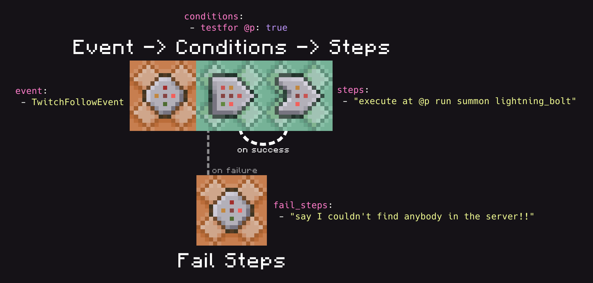
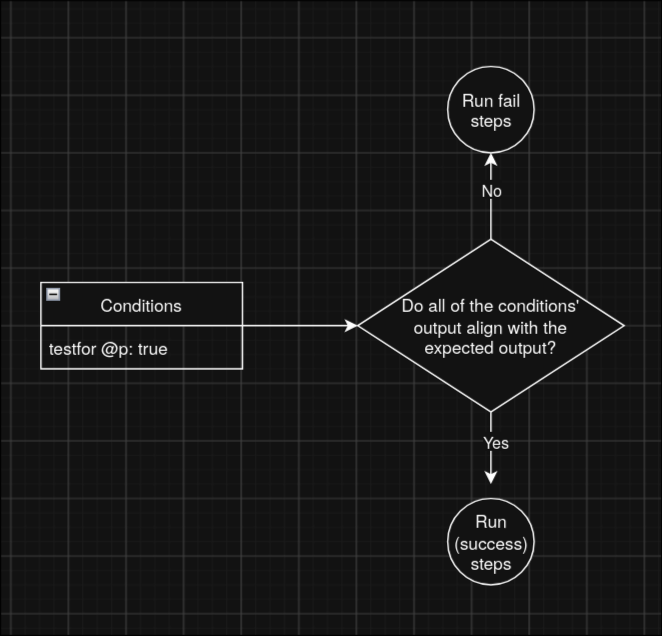

## Overview

The primary (and easiest) way to write instructions for ChatTriggers is through _workflows_. Workflows are tiny [YAML](https://yaml.org/) files that define conditions and commands.

```yaml
# The name of the workflow. It can be anything.
name: Example Workflow

# Events that trigger this workflow
event: 
 # You can have more workflows if you'd like, and 
 # they'd all trigger this workflow.
 - TwitchFollowEvent
 
# Commands that run before the workflow. If one of
# these commands succeed or fail unexpectedly,
# then it skips over the main steps. Optional.
conditions:
 # You can add more, if you'd like. The format
 # is <command>: <succcess/fail>, wherein `false`
 # means you're expecting it to fail and `true`
 # means you're expecting it to succeed.
 - testfor @p: true
 # By default, commands run at coordinated 0, 0, 0.
 # @p points to the closest entity, so it will
 # resolve to that. The testfor command returns
 # false (fail) if there was no mob found.

# If conditions succeed (or you don't have any),
# then these commands here run.
steps:
 - "execute at @p run summon lightning_bolt"
 # ...you can add more if you'd like

# If conditions fail, then the commands here run.
fail_steps:
 - "say I couldn't find anybody in the server!!"
 # ...you can add more if you'd like
```

## Structure

Workflows are composed of three primary parts: events, conditions, steps, and fail steps. Since almost everything is centered around commands, you may think of them as command blocks.



### Events
Events are what trigger your workflows.

```yaml
event: 
 - TwitchFollowEvent
```

You may have multiple events, and their order is arbitrary.

Using an unknown event will print out a warning, so don't worry about accidentally messing up the name of an event and having your workflow silently fail.

```
[20:44:36 WARNING]: [ChatTriggers] warning[W016]: unknown_event
[20:44:36 WARNING]: [ChatTriggers]  --> workflows/bad_event.yaml:4
[20:44:36 WARNING]: [ChatTriggers] 4 |  - EventThatDoesNotExist
[20:44:36 WARNING]: [ChatTriggers]   |  ^^^^^^^^^^^^^^^^^^^^^^^ Unrecognized event 'EventThatDoesNotExist'. Valid events are: AlertPlayingEvent, DonationEvent, LoyaltyStoreRedemptionEvent, MerchEvent, StreamLabelsEvent, StreamLabelsUnderlyingEvent, TwitchBitsEvent, TwitchBitsEvent, TwitchChannelPointsEvent, TwitchFollowEvent, TwitchFollowEvent, TwitchHostEvent, TwitchPredictionEvent, TwitchRaidEvent, TwitchRaidEvent, TwitchSubscriptionEvent, TwitchSubscriptionEvent.
```

### Conditions

Conditions run before any steps do, and are optional. They're a mapping of commands and their expected outcome (i.e., if it fails or not), and different things happen depending on if all the commands align their expected outcome. If **every command** aligns with their expected outcome, then `steps` will be ran. Otherwise, if defined, `fail_steps` will be ran.

```yaml
conditions:
 - testfor @p: true
```



Let's pretend we're the parser reading your workflow. We'll evaluate the following workflow and choose which list of steps to run based off of the conditions.

```yaml
name: Example Workflow

# Disregard the event for now, that's not what we're focused on.
event: 
 - TwitchFollowEvent
 
conditions:
 - testfor @p: true

steps:
 - "execute at @p run summon lightning_bolt"

fail_steps:
 - "say I couldn't find anybody in the server!!"
```

In this example, there's only one condition: `testfor @p: true`. What we'll do is run the command `testfor @p`, and see the output.

```
> testfor @p
[21:04:53 ERROR]: No targets matched selector
```

Looks like the command failed! In this case, the outcome is `false`. The expected outcome is `true`, so we should run `fail_steps`.

Now, let's try the same scenario but with a player in the game. Say we have a player spawned in, and we run the commmand again:

```
> testfor @p
[21:12:55 INFO]: Found Chalupa7235
```

This time, the command succeeded! The outcome is `true`, and since the expected outcome is also `true`, we should run `steps`.

!!! warning "About Condition Commands"
    Condition commands run as regular commands. Every command you run as a conditional command works functionally the same as if you had ran the command in the server console or in game chat.

**Conditions are optional**, so you can just omit them from your workflow to just have the workflow run `steps` every single time.

### Steps

Steps define the main actions that your workflows run. Steps are just a list of commands, and are ran in the same order as they are defined.

```yaml
steps:
 - "say Steps ran"

# Optional. If your conditions fail, and you don't have `fail_steps`, then nothing happens.
fail_steps:
 - "say Fail steps ran"
```