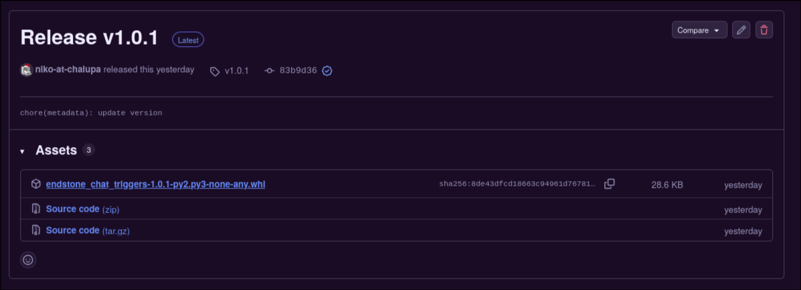

## Endstone

ChatTriggers uses the [Endstone](https://github.com/EndstoneMC/endstone/) modloader for Minecraft bedrock.

??? question "Why Endstone?"
    Endstone is a custom Minecraft: Bedrock Edition server that preserves vanilla features. Traditionally, if you wanted plugins that modified vanilla gameplay on Bedrock (while preserving vanilla features), you'd either have to go for the native addon and script APIs (which are notoriously unable to change vanilla gameplay that much) or use a Java server and use a proxy like Geyser to play on Bedrock.

This guide **assumes that you have an Endstone server already installed and set up**. If that is not the case, then check out this [guide here](https://endstone.dev/stable/getting-started/installation/#installation) to install Endstone and create a server with it.

## Installation Methods

> <div class="animated-header-wrap">
>   <h4>Installation through PyPI (RECOMMENDED!!)</h4>
> </div>
>
>
> The easiest way to install endstone-chat-triggers is through PyPI using `pip`.
> 
> Open your terminal/command prompt and run:
>
> ```bash
> pip install endstone-chat-triggers
> ```
>
> !!! tip "Updating"
    If you want to update the plugin, you can run `pip install --upgrade endstone-chat-triggers`.

<!-- -->

> <details>
> <summary>
> <div class="animated-header-wrap">
>   <h4>Installation through PyPI (<code>.whl</code> file)</h4>
> </div>
> </summary>
>
>
> If you'd prefer to install through a `.whl` file, you can just head over to our [releases page](https://github.com/niko-at-chalupa/endstone-chat-triggers/releases/tag/v1.0.1) and download it from there.
> 
> Go to the [releases page](https://github.com/niko-at-chalupa/endstone-chat-triggers/releases/tag/v1.0.1) and download the `.whl` file at the top (the name of the file may vary):
>
> 
>
> ...Then, take that `.whl` file and put it in your server's `plugins/` folder:
>
> 
>
> The plugin loader will automatically detect and load the `.whl` file.
>
> </details>

## Post-Install

After you're done installing the plugin, you'll see it log some things in your server's console. Such logs will be similar to the following:

<pre><code><div class="doesntmatter">...
[01:16:40 INFO]: This server is running Endstone version: 0.11.6 (Minecraft: 26.33)
[01:16:40 INFO]: Loading packs from 'resource_packs' (Resources)
[01:16:40 INFO]: Pack Stack - None
[01:16:41 INFO]: IPv4 supported, port: 19132: Used for gameplay and LAN discovery
[01:16:41 INFO]: IPv6 supported, port: 19133: Used for gameplay
</div>
[01:16:41 INFO]: [ChatTriggers] Loading chat_triggers v1.0.1
[01:16:41 ERROR]: [ChatTriggers] ****************************************
[01:16:41 ERROR]: [ChatTriggers] use_streamlabs is enabled but no streamlabs_socket_token was set! Disabling plugin.
[01:16:41 ERROR]: [ChatTriggers] 
[01:16:41 ERROR]: [ChatTriggers] Please check 
[01:16:41 ERROR]: [ChatTriggers] /home/niko/Development/repositories/endstone-chat-triggers/bedrock_server/plugins/chat_triggers/config.yaml
[01:16:41 ERROR]: [ChatTriggers] for more info!
[01:16:41 ERROR]: [ChatTriggers] ****************************************
<div class="doesntmatter">
[01:16:41 INFO]: Waiting for Minecraft services...
[01:16:41 INFO]: Server started.
[01:16:41 INFO]: ================ TELEMETRY MESSAGE ===================
[01:16:41 INFO]: Server Telemetry is currently not enabled. 
[01:16:41 INFO]: Enabling this telemetry helps us improve the game.
[01:16:41 INFO]: To enable this feature, add the line 'emit-server-telemetry=true'
[01:16:41 INFO]: to the server.properties file in the handheld/src-server directory
[01:16:41 INFO]: ======================================================
[01:16:42 INFO]: Packet limit config updated
</div>
[01:16:42 INFO]: [ChatTriggers] Enabling chat_triggers v1.0.1
[01:16:42 WARNING]: [ChatTriggers] No workflows were found in /home/niko/Development/repositories/endstone-chat-triggers/bedrock_server/plugins/chat_triggers/workflows.
</code></pre>

If you do not see the special logs sent out by ChatTriggers, then that's a sign you've probably installed the plugin incorrectly. If you need assistance in setting this plugin up, you can ask for support in my [Discord server](https://discord.gg/rtFfPaYQFP).


It's obvious that these logs are highlighting issues that the plugin has come across. The plugin is coming across issues because it still isn't configured.

<div class="grid cards" markdown>

-   **Next: Configuring ChatTriggers On Your Endstone Server**
  
    ---
  
    Now that we are done with installing the plugin, we can now move on to configuring it.
  
    [**:octicons-arrow-right-24: Configuration**](getting-started/configuration.md)
  
</div>