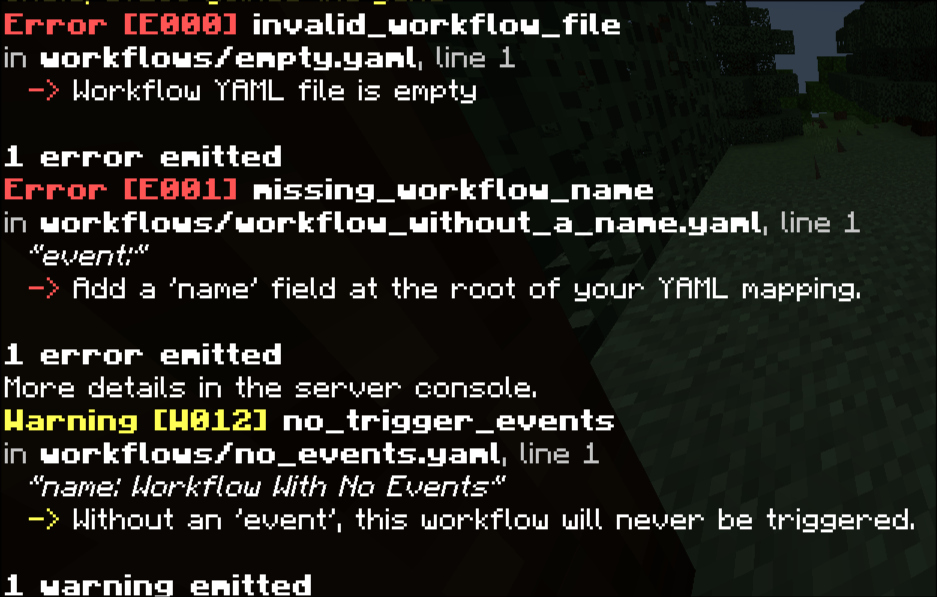

---

!!! quote "[TwitchSpawn](https://www.curseforge.com/minecraft/mc-mods/twitchspawn)"
    "A mod for twitch streamers. Handles live events with the rules handcrafted by the streamer!"

ChatTriggers is an [Endstone](https://endstone.dev/stable/) plugin that integrates with your live streams and has things trigger based off of different events.

## Features
> #### An easy way to bind to events
>
> Implements _workflows_, which are an easy way to have commands be ran upon an event.
>
> ```yaml
> # Small example of a basic workflow.
>
> # The name of the workflow. It can be anything.
> name: Give Chalupa7235 Diamonds on Follow
>
> # Events that trigger this workflow
> event: 
>   # You can have more workflows if you'd like, and 
>   # they'd all trigger this workflow.
>   - TwitchFollowEvent
>
> # Commands that run before the workflow. If one of
> # these commands succeed or fail unexpectedly,
> # then it skips over the main steps. Optional.
> conditions:
>   # You can add more, if you'd like. The format
>   # is <command>: <succcess/fail>, wherein `false`
>   # means you're expecting it to fail and `true`
>   # means you're expecting it to succeed.
>   - testfor Chalupa7235: true
>
> # If conditions succeed (or you don't have any),
> # then these commands here run.
> steps:
>   - "give Chalupa7235 diamond 64"
>   # ...you can add more if you'd like
>
> # If conditions fail, then the commands here run.
> fail_steps:
>   - "say Chalupa7235 isn't in the server!"
>   # ...you can add more if you'd like
> ```

<!-- -->

> #### A lot of events!!
>
> The plugin's able to respond to a wide variety of events! Donations, follows, subscriptions, resubs, bits...

<!-- -->

> #### A plugin API so external plugins can interact.
>
> Other plugins can interact with ChatTriggers, which means you're not limited to workflows.
>
> ```python
> from endstone_twitch_spawn import (
>     get_chat_triggers_api, 
>     TwitchFollowEvent, 
>     streamlabs_event_handler, 
>     ChatTriggersApi
> )
> from endstone.plugin import Plugin
>
> class ExamplePlugin(Plugin):
>     def on_enable(self):
>         # This will get the plugin, and then the 
>         # plugin's API.
>         api: ChatTriggersApi | None = get_chat_triggers_api(self.server.plugin_manager)
>
>         # Since we're doing everything right, there
>         # is little-to-no reason that this should 
>         # return None.
>         assert api, "`get_chat_triggers_api` returned `None`"
>         self.api: TwitchSpawnApi = api
>         
>         # Just like Endstone's register_events, you
>         # can make a sperate listener class in a
>         # different module to make >everything cleaner.
>         self.api.register_events(self)
>
>     @streamlabs_event_handler
>     def on_twitch_follow(self, event: TwitchFollowEvent):
>         # Simple test log so you can see that the 
>         # plugin's API is funcitonal.
>         self.logger.info("Somebody followed!!")
> ```

<!-- -->

> #### Detailed error logging
>
> Catch errors in your workflows _before_ they get the chance to mess anything up.
>
> ```log
> [11:37:10 ERROR]: [ChatTriggers] error[E000]: invalid_workflow_file
> [11:37:10 ERROR]: [ChatTriggers]  --> workflows/empty.yaml:1
> [11:37:10 ERROR]: [ChatTriggers]   | ^ (source unavailable) — Workflow YAML file is empty
> [11:37:10 ERROR]: [ChatTriggers] 
> [11:37:10 ERROR]: [ChatTriggers] 1 error emitted
> [11:37:10 ERROR]: [ChatTriggers] error[E001]: missing_workflow_name
> [11:37:10 ERROR]: [ChatTriggers]  --> workflows/workflow_without_a_name.yaml:1
> [11:37:10 ERROR]: [ChatTriggers] 1 | event: 
> [11:37:10 ERROR]: [ChatTriggers]   | ^^^^^^ Add a 'name' field at the root of your YAML mapping.
> [11:37:10 ERROR]: [ChatTriggers] 
> [11:37:10 ERROR]: [ChatTriggers] 1 error emitted
> [11:37:10 WARNING]: [ChatTriggers] warning[W012]: no_trigger_events
> [11:37:10 WARNING]: [ChatTriggers]  --> workflows/no_events.yaml:1
> [11:37:10 WARNING]: [ChatTriggers] 1 | name: Workflow With No Events
> [11:37:10 WARNING]: [ChatTriggers]   | ^^^^^^^^^^^^^^^^^^^^^^^^^^^^^ Without an 'event', this workflow will never be triggered.
> [11:37:10 WARNING]: [ChatTriggers] 
> [11:37:10 WARNING]: [ChatTriggers] 1 warning emitted
> ```
>
> 

<br />

# Start
<div class="grid cards" markdown>

-   **Install ChatTriggers On Your Endstone Server**
  
    ---
  
    Follow the short guide to install and configure ChatTriggers on your Endstone server.
  
    [**:octicons-arrow-right-24: Getting Started**](getting-started/installation.md)
  
</div>